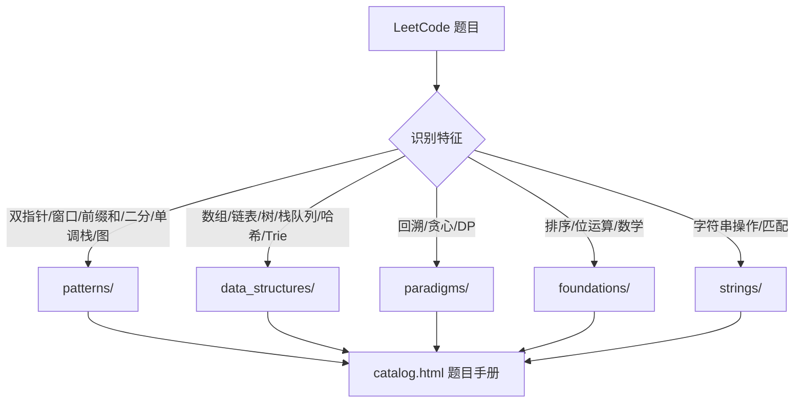

# Algorithm 代码库

[](https://github.com/Liangyq1995/algorithm)

LeetCode 刷题实现合集，按 **解题模式 → 数据结构 → 算法范式** 三层组织。每个题目对应独立的纯函数或设计类，附带题号 docstring，可直接调用或查阅。

| 指标 | 数量 |
|------|------|
| 解题函数 | 380+ |
| 带详细题解元数据 | 331 |
| 覆盖模块 | 15 个分类 |

## 特性

- **按模式分类** — 双指针、滑动窗口、前缀和、二分、单调栈、图论等通用技巧独立成模块，便于举一反三
- **纯函数优先** — 绝大多数题目为模块级函数，无无效的 `@abstractmethod` 包装；设计题（LRU、Trie 等）保留为独立类
- **可浏览的题目手册** — 内置 `catalog.html`，按分类展示题面、思路、代码与复杂度
- **统一公共工具** — `ListNode` / `TreeNode`、KMP 等公共逻辑集中在 `common/`

## 目录结构

```
algorithm/
├── common/                     # 公共定义（ListNode、TreeNode、KMP）
├── foundations/                # 基础（排序、位运算、数学）
├── patterns/                   # 通用解题模式
│   ├── two_pointers/           #   双指针
│   ├── sliding_window/         #   滑动窗口
│   ├── prefix_sum/             #   前缀和
│   ├── binary_search/          #   二分查找
│   ├── monotonic_stack.py      #   单调栈
│   └── graph/                  #   图论（BFS/DFS/并查集/最短路）
├── data_structures/            # 数据结构专题
│   ├── array/                  #   数组
│   ├── matrix/                 #   矩阵
│   ├── linked_list/            #   链表
│   ├── tree/                   #   二叉树 / BST
│   ├── stack_queue/            #   栈、队列、堆、设计题
│   ├── hash_map/               #   哈希表
│   └── trie/                   #   字典树
├── paradigms/                  # 算法范式
│   ├── backtracking/           #   回溯
│   ├── greedy/                 #   贪心
│   └── dynamic_programming/    #   动态规划（线性/背包/股票/序列/网格）
├── strings/                    # 字符串操作与模式匹配
├── meta/                       # 题目元数据（题面、思路、复杂度，供 catalog 使用）
├── generate_catalog.py         # 生成 catalog.html
├── catalog.html                # 可离线浏览的题目手册
└── README.md
```

## 快速开始

### 克隆仓库

```bash
git clone git@github.com:Liangyq1995/algorithm.git
cd algorithm
```

### 调用解题函数

**方式一：在仓库根目录直接导入**（推荐）

```python
from patterns.two_pointers.array import three_sum
from paradigms.dynamic_programming.knapsack import coin_change_min
from data_structures.tree.tree import level_order

print(three_sum([-1, 0, 1, 2, -1, -4]))
# [[-1, -1, 2], [-1, 0, 1]]

print(coin_change_min(11, [1, 2, 5]))
# 3
```

**方式二：作为包从上级目录导入**

若将仓库放在 `gitfile/algorithm/`，可在 `gitfile/` 下执行：

```python
from algorithm.patterns.two_pointers.array import three_sum
from algorithm.paradigms.dynamic_programming.knapsack import coin_change_min
```

### 浏览题目手册

直接在浏览器中打开 [`catalog.html`](catalog.html)，或重新生成：

```bash
python generate_catalog.py
# 输出 → catalog.html
```

`generate_catalog.py` 会扫描所有 `.py` 源文件，结合 `meta/` 中的题解元数据，生成带搜索与分类导航的静态页面。

## 模块索引

### common/ — 公共工具

| 文件 | 内容 |
|------|------|
| `nodes.py` | `ListNode`、`TreeNode` 节点定义 |
| `kmp.py` | `build_next`、`kmp_search`、`str_str` |

### foundations/ — 基础算法

| 文件 | 内容 |
|------|------|
| `sorting.py` | 快速排序 |
| `math_sort.py` | 分数转小数、归并排序（排序数组） |
| `bit_manipulation.py` | 位运算专题 |

### patterns/ — 解题模式

| 文件 | 内容 |
|------|------|
| `two_pointers/array.py` | 双指针：三数之和、盛水、去重、快慢指针等 |
| `sliding_window/window.py` | 滑动窗口：最小覆盖子串、无重复最长子串等 |
| `prefix_sum/prefix.py` | 前缀和 + 哈希 |
| `prefix_sum/min_subarray_divisible_by_p.py` | 和可被 K 整除的最短子数组 |
| `binary_search/basic.py` | 标准二分、搜索旋转数组、寻找峰值等 |
| `binary_search/median_of_two_sorted_arrays.py` | 两个有序数组的中位数 |
| `monotonic_stack.py` | 单调栈：每日温度、柱状图最大矩形等 |
| `graph/graph.py` | 岛屿数量、克隆图、课程表 |
| `graph/extended.py` | 单词接龙、网络延迟、并查集、Dijkstra 等 |

### data_structures/ — 数据结构

| 文件 | 内容 |
|------|------|
| `array/basic.py` | 数组：合并、旋转、缺失/重复数字等 |
| `matrix/matrix.py` | 矩阵搜索、置零、螺旋遍历 |
| `linked_list/linked_list.py` | 链表：反转、环检测、合并、重排等 |
| `tree/tree.py` | 二叉树 / BST：遍历、路径、LCA、序列化等 |
| `stack_queue/stack_queue.py` | 有效括号、最小栈、用栈实现队列、LRU 等 |
| `hash_map/hash_map.py` | 两数之和、字母异位词、Top K 等 |
| `trie/trie.py` | 字典树（Trie）及前缀搜索 |

### paradigms/ — 算法范式

| 文件 | 内容 |
|------|------|
| `backtracking/core.py` | 回溯独立函数：N 皇后、括号生成、单词搜索等 |
| `backtracking/backtracking.py` | 回溯类模板（历史遗留，新题请用 `core.py`） |
| `greedy/greedy.py` | 贪心：跳跃游戏、区间合并、任务调度等 |
| `dynamic_programming/linear_dp.py` | 线性 DP：最大子数组、爬楼梯、打家劫舍 |
| `dynamic_programming/knapsack.py` | 背包系列：0-1 背包、完全背包、零钱兑换 |
| `dynamic_programming/stock.py` | 股票系列：一次/多次交易、冷冻期 |
| `dynamic_programming/sequence_dp.py` | 子序列 / 编辑距离 / 回文 |
| `dynamic_programming/grid_dp.py` | 网格 / 三角形 / 博弈 |

### strings/ — 字符串

| 文件 | 内容 |
|------|------|
| `operations.py` | Z 字形变换、整数反转、字符串相乘等 |
| `pattern_matching.py` | 重复子串、KMP 应用 |

## 代码规范

| 原则 | 说明 |
|------|------|
| 函数即题目 | 每个 LeetCode 题对应一个函数，docstring 首行写 `"题号. 题名"` |
| 纯函数优先 | 能写成纯函数的不用类；设计题（`LRUCache`、`Trie` 等）保留为类 |
| 公共逻辑复用 | KMP 的 `build_next` 统一在 `common/kmp.py`；区间合并只在 `greedy.py` 保留一份 |
| 类型标注 | 函数签名使用 `list[int]`、`Optional` 等标准类型提示 |
| 元数据分离 | 详细题面、思路、复杂度写在 `meta/`，由 `generate_catalog.py` 注入到 HTML |

## 组织思路



## License

个人学习用途，欢迎 Star 与 Fork。
